[portfolio](https://webme-psi.vercel.app/) &nbsp;·&nbsp;
[linkedin](https://www.linkedin.com/in/mouad-hassari/) &nbsp;·&nbsp;
[email](mailto:md.hassari@gmail.com)

> **IT-Specialist | Senior Computer Science Student @AUI** 
> Full-stack development, cybersecurity, and campus IT operations.

I am a Computer Science and Engineering student at Al Akhawayn University with
more than three years of practical IT support experience. I build websites,
dashboards, backend systems, databases, and business-focused digital solutions
while developing deeper expertise in cybersecurity and systems administration.

My profile sits between software and operations: I understand how a product is
built, how real users interact with it, and how the surrounding systems are
supported when something breaks. My Communication Studies minor also adds
photography, videography, visual design, and client communication to that mix.

**Al Akhawayn University in Ifrane** &nbsp;·&nbsp; <samp>part-time IT help-desk specialist · 2023—present</samp> 
Provide front-line support for Windows endpoints, peripherals, account access,
network and VPN issues, classrooms, and university computer labs. Improved
triage and repeat-fix documentation, reducing average resolution time by about
80%, and supported imaging, deployment, and configuration of 50+ lab machines.

<samp>typescript &nbsp; next.js 16 &nbsp; react 19 &nbsp; postgresql &nbsp; prisma &nbsp; tailwind css &nbsp; zod &nbsp; recharts &nbsp; vercel &nbsp; neon</samp>

<samp>windows &nbsp; linux &nbsp; active directory &nbsp; microsoft 365 &nbsp; tcp/ip &nbsp; dns &nbsp; dhcp &nbsp; vpn &nbsp; rdp &nbsp; git</samp>

**RoomPulse** &nbsp;·&nbsp; <samp>in development · campus IT operations</samp> 
An internal AUI platform for QR-based classroom issue reporting, staff ticket
triage, room and category administration, analytics, room-health scoring, QR
labels, and protected evidence attachments. Built with Next.js 16, React 19,
TypeScript, PostgreSQL, Prisma, Tailwind CSS, Zod, Recharts, Vercel, and Neon.

**project_02** &nbsp;·&nbsp; <samp>status: ideating</samp> 
Problem discovery in progress. The project will appear here after its purpose,
scope, and users are clearly defined.

**project_03** &nbsp;·&nbsp; <samp>status: loading</samp> 
Next build queued. Details remain hidden until there is something real to ship.

**Google Cybersecurity Professional Certificate** 
Cybersecurity fundamentals, network security, Linux, SQL, Python, SIEM, and IDS.

**CS50 Introduction to Cybersecurity** 
Threat analysis, authentication, encryption, malware, web security, privacy,
and risk-based security thinking.

Every graphic is generated or stored inside this repository. The terminal hero
renders the quote “you are less valuable than the data you produce” with a
one-shot SMIL typing animation. The statistics are redrawn daily from GitHub's
GraphQL API by a scheduled GitHub Action, which commits only files that changed.

No third-party statistics-card server is used. The SVGs use system monospace
fonts, so the repository contains no bundled font binaries.

Adapted from the self-generated profile README system by
[andriidrok1](https://github.com/andriidrok1/andriidrok1). Original attribution
and portrait-pipeline notes are preserved in [CREDITS.md](CREDITS.md).
