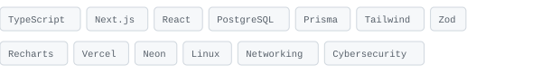
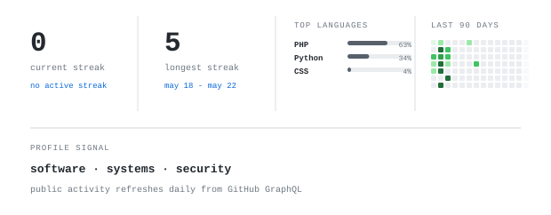

[portfolio](https://webme-psi.vercel.app/) &nbsp;·&nbsp;
[linkedin](https://www.linkedin.com/in/mouad-hassari/) &nbsp;·&nbsp;
[email](mailto:md.hassari@gmail.com)

> Computer Science and Engineering student at Al Akhawayn University in Ifrane, 
> based in Casablanca and working across software, systems, and security.

I combine more than three years of university IT-support experience with
full-stack development and a growing cybersecurity specialization. I build
websites, e-commerce platforms, dashboards, backend systems, databases, and
business-focused digital solutions.

My profile sits between development and operations: I understand how a product
is built, how users interact with it, and how the surrounding environment is
supported when something breaks.

<samp>Google Cybersecurity Professional &nbsp;·&nbsp; CS50 Introduction to Cybersecurity</samp>

**RoomPulse** &nbsp;·&nbsp; <samp>Next.js, TypeScript, PostgreSQL, Prisma, Tailwind, QR</samp> 
Campus asset and inventory platform for Al Akhawayn University. It supports
QR-based issue reporting, room and device tracking, maintenance workflows,
protected evidence attachments, and operational analytics.

**ideating** &nbsp;·&nbsp; <samp>coming soon</samp> 
Problem discovery in progress. Details will appear after the scope and users are
clear enough to justify building it.

**loading** &nbsp;·&nbsp; <samp>coming soon</samp> 
The next project remains hidden until there is something real to ship.

Every graphic on this page is stored or generated inside this repository. The
portrait is a row-by-row animated ASCII rendering based on my photo. GitHub
activity is rebuilt daily using GitHub's GraphQL API and committed only when the
output changes.

No external statistics-card server is used, so the profile does not depend on a
third-party service staying online or avoiding rate limits.

Profile system adapted from the self-generated README approach by
[andriidrok1](https://github.com/andriidrok1/andriidrok1). See
[CREDITS.md](CREDITS.md).
